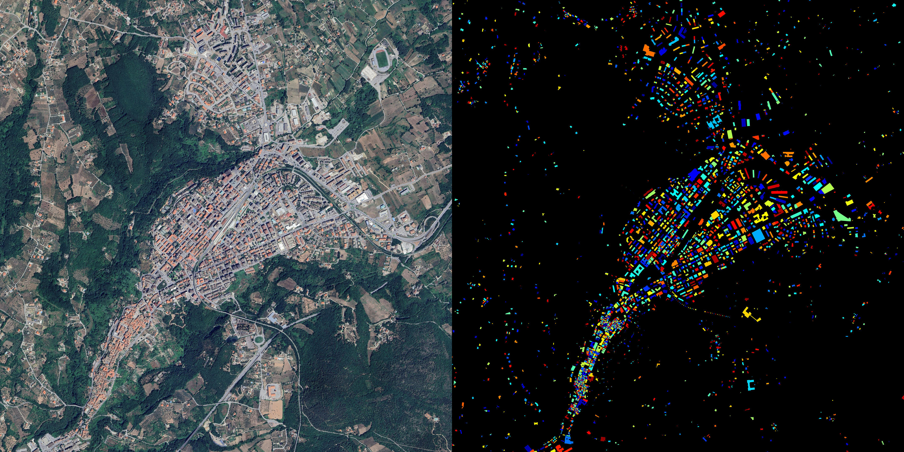

# Snitcher



> [!NOTE]
> **STATUS - Work in progress:** This project is currently in a functional prototype stage. APIs, CLI arguments, and internal logic are subject to change.

**Snitcher** is a geospatial software pipeline designed to bridge the gap between official Italian Cadastral data (Catasto) and open-source mapping platforms like OpenStreetMap (OSM).

Its primary function is to extract high-precision building footprints from Italian Cadastral Cartography (Catasto) via WMS (Web Map Service) layers, convert them into vector data, and prepare them for comparison with satellite imagery.

The core objectives are:

1. **Discrepancy Detection ("Snitching"):** Identify inconsistencies between declared buildings (Cadastral map) and actual physical structures (Satellite imagery).
2. **OSM Integration:** Generate clean, topologically valid changesets to update OpenStreetMap with high-precision building polygons.

## System Architecture

The project is divided into two distinct operational modules: **Data Acquisition** and  **Feature Extraction** .

### 1. The Harvester (`downloader.py`)

Responsible for interfacing with the WMS server. It handles:

* Coordinate transformation (WGS84 to UTM).
* Grid segmentation and parallel downloading.
* Image stitching to produce high-resolution, analysis-ready imagery.

### 2. The Processor (`snitcher.py`)

The core engine that consumes the stitched imagery. It performs:

* **Segmentation:** Extracts building masks and black borders.
* **Topological Repair:** Enforces OSM compliance by merging shared vertices and subdividing edges where neighbors touch.
* **GeoJSON Export:** Outputs structured vector data.

## Installation & Requirements

Snitcher requires  **Python 3** . It relies heavily on OpenCV for image processing and SciPy for geometric operations.

1. Clone the repository:
   
   ```bash
   git clone https://github.com/yourusername/snitcher.git
   cd snitcher
   ```

2. Install dependencies:
   
   ```bash
   pip install opencv-python numpy shapely requests pillow pyproj scipy
   ```

## Usage

### Step 1: Acquire Data

Use the downloader to fetch high-resolution WMS tiles.

*Note: Currently, the bounding box is hardcoded in `downloader.py`. You must edit the `BBOX_LATLON` variable within the script before running.*

```python
# Edit downloader.py
BBOX_LATLON = (45.459589, 9.160709, 45.469627, 9.180429) # Example: Milan
```

Run the downloader:

```bash
python downloader.py
```

*Output: A stitched image file (default: `test-maps/cadastral_map.png`)*

### Step 2: Extract Buildings

Run the main processor on the downloaded image to generate vectors.

**Syntax:**

```bash
python snitcher.py <image_path> [output_dir] [epsilon] [bbox]
```

**Arguments:**

* `image_path`: Path to the input PNG (required).
* `output_dir`: Directory to save results (default: `./output`).
* `epsilon`: Douglas-Peucker simplification factor (default: `3.0`). Higher = simpler shapes.
* `bbox`: The WGS84 bounding box used to download the image, formatted as `'min_lat,min_lon,max_lat,max_lon'`. Required if you want the output GeoJSON to have Lat/Lon coordinates instead of pixel coordinates.

**Example:**

```bash
python snitcher.py test-maps/cadastral_map.png ./results 4 '45.459589,9.160709,45.469627,9.180429'
```

## Output & Debugging

The tool generates a comprehensive set of outputs in the specified directory:

* **`buildings.geojson`** : The final vector file containing building polygons.
* **`debug/`** : A folder containing visualizations of every step in the pipeline:
* `03_black_borders.png`: Detected separators.
* `04_separated_buildings.png`: Morphological separation.
* `05_connected_components.png`: Distinct building identification.
* `07_final_OSM_topology.png`: Final verification of vertex placement.

## Module 1: Data Acquisition (`downloader.py`)

To detect building outlines accurately, standard web map resolution is insufficient. The downloader ensures pixel density is high enough to resolve building corners and separators.

1. **Input Configuration:**
   * Accepts a Bounding Box (BBOX) in Latitude/Longitude (WGS84).
   * Target Resolution: `PIXELS_PER_METER` (typically set to 10 for high precision).
2. **Coordinate Transformation:**
   * The script transforms the WGS84 BBOX into  **UTM Zone 32N (EPSG:25832)** .
   * *Reasoning:* UTM provides a Cartesian coordinate system (meters), which is essential for calculating accurate grid sizes and stitching images without distortion.
3. **Grid Calculation:**
   * The script calculates the total area dimensions in meters.
   * It divides the area into a grid of tiles, ensuring no tile exceeds the WMS service limit (`MAX_TILE_SIZE = 2048px`).
4. **Parallel Execution:**
   * Using `ThreadPoolExecutor`, the script downloads tiles concurrently.
   * *Reasoning:* WMS servers can be slow; parallel requests maximize bandwidth usage and reduce total download time.
5. **Stitching:**
   * Individual tiles are stitched into a single seamless PNG image with an Alpha channel.

## Module 2: Feature Extraction (`snitcher.py`)

This module converts the raw raster image into vector data. The Cadastral map style renders buildings as orange polygons (#ec801) surrounded by black border lines on a transparent background.

### The "Adjacent Building" Challenge

A critical requirement for OSM integration is the correct handling of  **Terraced Housing/Adjacent Buildings** .

* **The Problem:** In the raster image, two adjacent buildings share a black border line. If we simply vectorize the colored blobs, we get two polygons separated by a gap (the width of the border line).
* **The Requirement:** OSM topology requires that adjacent buildings share the **exact same nodes** (vertices). There should be no gaps and no overlaps.
  * *Condition 1:* If Polygon A and Polygon B touch, they must share the vertices along the touching edge.
  * *Condition 2:* If a vertex of Polygon B lies in the middle of Polygon A's edge, Polygon A's edge must be split to include that vertex (Edge Subdivision).

### Processing Pipeline

#### Step 1: Image Pre-processing

The script isolates the alpha channel to identify building masses and extracts black pixels to identify borders.

#### Step 2: Contour Detection & Hierarchy

* **Action:** Uses `cv2.findContours` with `RETR_CCOMP`.
* **Reasoning:** This retrieves not just the outer shape of the building, but also inner holes (courtyards), establishing a parent-child relationship essential for accurate geometry.

#### Step 3: Simplification

* **Action:** Applies the  **Douglas-Peucker algorithm** .
* **Reasoning:** Raster outlines are jagged (stair-step effect). Simplification reduces the vertex count to only the essential geometric corners.

#### Step 4: Topological Repair (The "Snitching")

This is the most complex phase, ensuring OSM compliance.

1. **Vertex Merging (Clustering):**
   * Uses a **KD-Tree** to find vertices from different polygons that are within a few pixels of each other.
   * Merges these into a single coordinate (centroid).
   * *Result:* Removes micro-gaps between corners of adjacent buildings.
2. **Edge Subdivision:**
   * *Logic:* Iterates through all polygon edges. If a vertex from a *neighboring* polygon lies on an edge (within a tolerance), that vertex is inserted into the current edge.
   * *Result:* Ensures that if Building A is larger than Building B, Building A splits its wall exactly where Building B starts and ends.

### 4.3 Output

The final output is a  **GeoJSON FeatureCollection** .

* Includes properties: `building_id`, `vertices` count, `area_m2`, and `has_holes`.
* Coordinates are transformed back from Pixel space to WGS84 (Lat/Lon) using the original BBOX.

## Roadmap

The following features are planned for future releases:

* [ ] **Satellite Comparison:** Integration with satellite imagery (Bing/Maxar) to validate roofs against cadastral footprints.
* [ ] **CLI Refinement:** Update `downloader.py` to accept command-line arguments for BBOX instead of hardcoded values.
* [ ] **Dynamic CRS:** Auto-detection of UTM zones (currently hardcoded to EPSG:25832/UTM 32N).
* [ ] **OSM Tagging:** Automatic addition of `building=yes` and source tags to the GeoJSON.
* [ ] **Performance:** Optimization of the KD-Tree implementation for processing city-scale datasets.

## License

---

*Disclaimer: This tool is intended for data analysis and research purposes. Users must comply with the terms of service of the Agenzia delle Entrate WMS server.*


